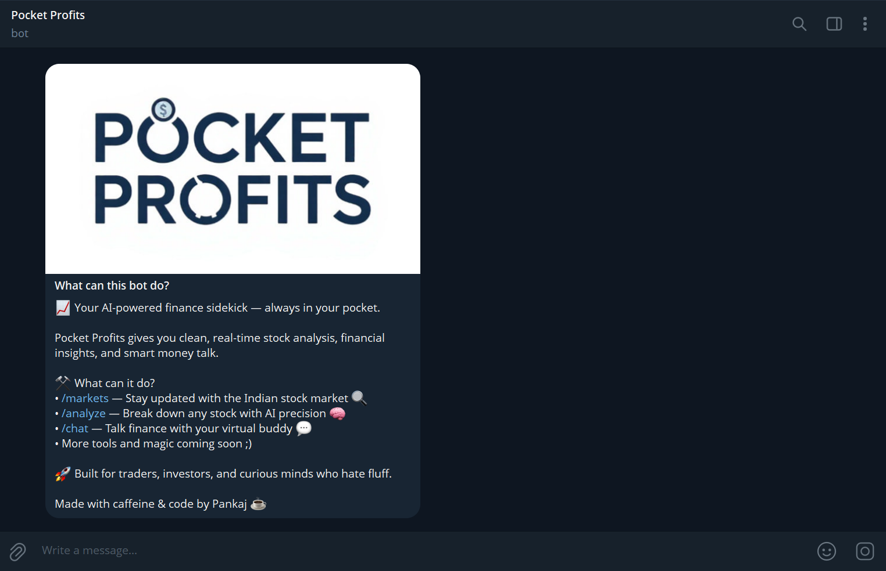

# PocketProfits (Finance Bot AI) - Replit Setup




PocketProfits is a Telegram bot designed to provide stock analysis and financial insights. It leverages the Google Gemini API for AI-driven analysis and yfinance for fetching stock data. For broader market overview data, it's configured to use the "Yahoo Finance by API DOJO" via RapidAPI.

This guide explains how to set up and run PocketProfits on **Replit** by importing the GitHub repository.

## Features

*   **Multi-Step Stock Analysis**: Performs a detailed, multi-step fundamental analysis of stocks, covering:
    *   Step 1: Stock Overview
    *   Step 2: Detailed Financial Statements & Ratios (Income Statement focused)
    *   Step 3: Balance Sheet & Cash Flow Analysis
    *   Final Step: Comprehensive AI Summary with strengths, weaknesses, and ratings.
*   **AI-Powered Insights**: Uses Gemini to interpret financial data and provide qualitative analysis.
*   **Interactive Chat**: Engage in a conversational chat about finance topics with FinBuddy, your AI finance assistant.
*   **User-Friendly Interface**: Easy navigation through Telegram inline keyboard buttons.
*   **Customizable Bot Personality**: AI responses are guided by a defined personality for consistency.
*   **Large Number Formatting**: Financial figures like market cap are formatted into Crores/Lakhs for INR stocks for better readability.

## Setup on Replit

**1. Import Repository into Replit**
   1.  Go to [Replit](https://replit.com/).
   2.  Log in or sign up for an account.
   3.  Click on the "+" (Create Repl) button.
   4.  Select "Import from GitHub" (usually found on the top right of the creation modal).
   5.  Paste the GitHub repository URL: `https://github.com/pankajtinwal/PocketProfits.git`
   6.  Replit will clone the repository and set up the Python environment.

**2. Obtain API Keys and Token**
   Before configuring the bot, you need to obtain the following API keys. (This process is external to Replit):

   *   **Telegram Bot Token**:
      1.  Open Telegram and search for "BotFather".
      2.  Start a chat with BotFather and send the `/newbot` command.
      3.  Follow the instructions to choose a name and username for your bot.
      4.  BotFather will provide you with an HTTP API token. Copy this token.

   *   **Google Gemini API Key**:
      1.  Go to the [Google AI Studio](https://aistudio.google.com/app/apikey).
      2.  Sign in with your Google account.
      3.  Click on "Get API key" or "Create API key in new project".
      4.  Follow the instructions to generate your API key. Copy it.

   *   **RapidAPI Key (for Yahoo Finance by API DOJO)**:
      1.  Go to [RapidAPI](https://rapidapi.com/).
      2.  Sign up or log in.
      3.  Search for "Yahoo Finance by API DOJO" and subscribe to its basic (free) plan.
      4.  Navigate to the API's dashboard/endpoints tab to find your `X-RapidAPI-Key`. Copy this key.

**3. Configure Secrets in Replit**
   Replit uses "Secrets" to securely store environment variables. Do **not** create a `.env` file for Replit.
   1.  In your Replit workspace for PocketProfits, look for the "Secrets" tab in the left sidebar (it has a key icon 🔑).
   2.  Add the following secrets:
      *   `Key`: `TELEGRAM_BOT_TOKEN`  =>  `Value`: `YOUR_TELEGRAM_BOT_TOKEN_HERE`
      *   `Key`: `GEMINI_API_KEY`      =>  `Value`: `YOUR_GEMINI_API_KEY_HERE`
      *   `Key`: `RAPIDAPI_KEY`        =>  `Value`: `YOUR_RAPIDAPI_KEY_HERE`
   3.  Replace the placeholder values with your actual token and keys.

**4. Install Dependencies (if necessary)**
   Replit usually installs dependencies from `requirements.txt` automatically when you first run the Repl or if it detects changes.
   If you need to manually install or update dependencies, open the "Shell" tab in Replit and run:
   ```bash
   pip install -r requirements.txt
   ```

## Running the Bot on Replit

*   **Using the "Run" Button:**
    The easiest way to run the bot is by clicking the large "Run" button at the top of the Replit interface. Replit should be configured to execute `python main.py` (this is typically set up in a hidden `.replit` file).

*   **Using the Shell (Alternative):**
    1.  Open the "Shell" tab in your Replit workspace.
    2.  Type the following command and press Enter:
        ```bash
        python main.py
        ```

   Your Telegram bot should now be online and responsive, running on Replit.

## Usage

   Interact with your bot on Telegram:
   *   Use the `/start` command to see the main menu.
   *   Navigate through the inline buttons to analyze stocks or chat with the AI.

---
